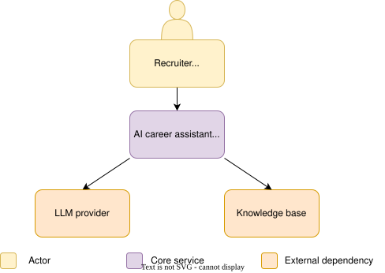
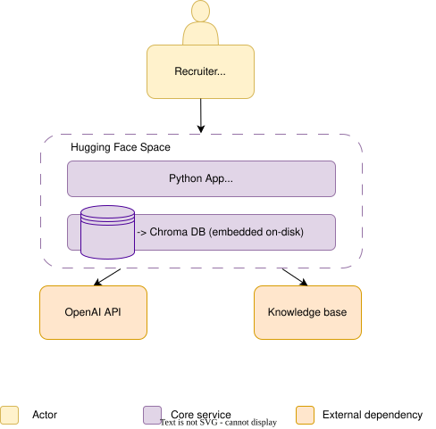

# Architecture

## 1. Overview

The AI Career Assistant is a Retrieval-Augmented Generation (RAG) application that enables users to explore professional experience through natural language conversations.

The system retrieves relevant information from a curated knowledge base before generating responses. This approach improves factual accuracy, transparency, and maintainability.

The architecture emphasizes modularity, reproducibility, and incremental evolution.

---

## 2. Design Principles

- Modular architecture.
- Clear separation of concerns.
- Ground responses using retrieved evidence.
- Keep components loosely coupled.
- Prioritize maintainability over complexity.
- Favor configuration over hardcoded values.
- Design for iterative improvement.

---

## 3. High-Level Architecture

The system consists of a user-facing application, a retrieval pipeline, a vector database, and an external LLM.

---

## 4. System Components

| Component | Responsibility |
|----------|----------------|
| User Interface | Accept user input and display responses. |
| RAG Service | Orchestrate retrieval and response generation. |
| Retriever | Retrieve relevant document chunks. |
| Embedding Model | Convert documents and queries into vector embeddings. |
| Vector Database | Store and search document embeddings. |
| Knowledge Base | Store curated project documentation and professional experience. |
| LLM Provider | Generate responses using retrieved context. |
| Configuration | Manage application settings and secrets. |

---

## 5. Data Flow

1. User submits a question.
2. The query is converted into an embedding.
3. Relevant document chunks are retrieved.
4. Retrieved context is added to the prompt.
5. The LLM generates a grounded response.
6. The application returns the response based on supporting sources.

---

## 6. Deployment Architecture

The application is deployed as a containerized web application hosted on Hugging Face Spaces.

External services are accessed through secure API connections.

---

## 7. Security Considerations

- Store secrets in environment variables.
- Never commit credentials to source control.
- Restrict the knowledge base to public professional information.
- Keep dependencies version controlled.
- Isolate configuration from application code.

---

## 8. Future Architecture

The architecture is designed to support future extensions without major redesign.

Potential enhancements include:

- Hybrid retrieval.
- Conversation memory.
- Automated evaluation.
- Monitoring and observability.
- User feedback collection.
- Additional knowledge sources.
- CI/CD pipeline.
- Multi-model support.